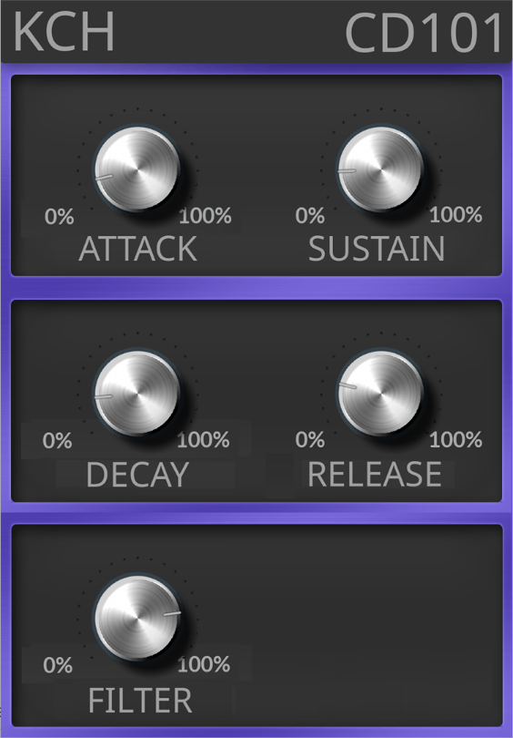

# KCH CD101 Audio Plugin

This repository contains a simple plugin that can be used to interact with the CD101 design from a digital audio workstation.
It processes midi commands and converts them into SPI control messages for the external hardware synth.



In addition, the repo contains a small command line tool to manually configure parameters of the hardware synth.

## Working Principle

The tools used here connect to FTDI FT232H USB devices in MPSSE mode to implement an SPI connection.
The code used here realizes `SCK` on `ADBUS0`, `MOSI` on `ADBUS1` and `NSS` on `ADBUS2`.
This pin mapping matches the pinout of the CD101 FPGA firmware on the [UPduino 3.1](https://github.com/tinyvision-ai-inc/UPduino-v3.0/blob/master/Board/v3.01/UPduino_v3.01.pdf) board, so the onboard FTDI chip used to program the FPGA can also be used to communicate with the SPI slave on the FPGA.

## Installing Prerequisites

This was last tested on Fedora 42. First install some system packages:

```bash
sudo dnf install gcc libftdi-devel libX11-devel
```

Then install the D compiler and package manager:

```bash
wget https://github.com/ldc-developers/ldc/releases/download/v1.40.1/ldc2-1.40.1-linux-x86_64.tar.xz
tar xf ldc2-1.40.1-linux-x86_64.tar.xz
export PATH=$PATH:$PWD/ldc2-1.40.1-linux-x86_64/bin
```

## Building the Command Line Helper

Simple compile the sources like this:
```
ldc2 source/cli.d source/ftdi.d -g -L-lftdi1 -of cd101
```

## Using the Command Line Helper

To configure the FPGA Synth parameters:
```bash
./cd101 HZ FILT A D S R
```

With the following parameters:

| Name   | Range     | Description                 |
|--------|-----------|-----------------------------|
| `HZ`   | 1 - 20000 | Oscillator Frequency        |
| `FILT` | 0.0 - 1.0 | Filter Value (1 = Open)     |
| `A`    |           | Amplitude envelope: Attack  |
| `D`    |           | Amplitude envelope: Decay   |
| `S`    |           | Amplitude envelope: Sustain |
| `R`    |           | Amplitude envelope: Release |

For example:
```bash
./cd101 440 0.5 1 40 0.8 500
```

To send triggers using the SPI connection:
```bash
./cd101 trig
```

## Building the Plugin

First we need to build the `dplug-build` helper:
```bash
git clone https://github.com/AuburnSounds/Dplug.git Dplug
cd Dplug/tools/dplug-build
git checkout v15.0.22
dub
cd ../../../
```

Now we can build the LV2 plugin:
```bash
./Dplug/tools/dplug-build/dplug-build --config LV2
```

## Using the Plugin

To install the plugin: (You can also download prebuilt binaries from this page)
```bash
mkdir -p ~/.lv2
cp -R 'builds/Linux-64b-LV2/KCH CD101 Synth.lv2' ~/.lv2/
```

Then just open your DAW, add the plugin and enable midi inputs to the plugin to trigger it.

## Warning

Note that the plugin does currently not report whether it successfully opened the USB device.
If it could not do that for some reason, it will simply do nothing.